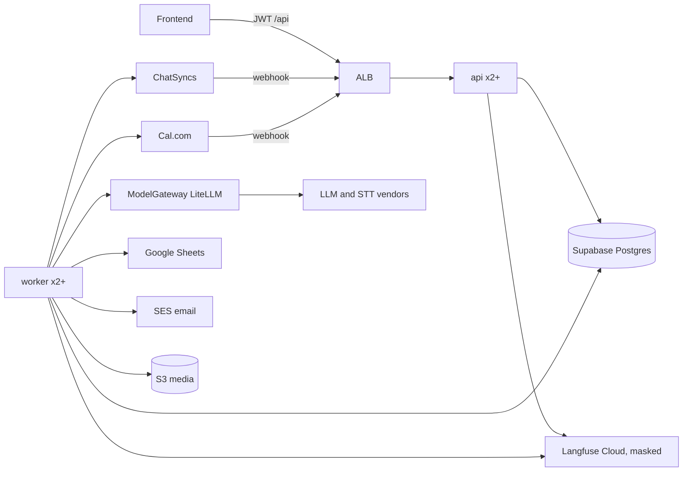

# Vyavsay Assist v2: Target Architecture

**Summary**
1. Paradigm: a modular monolith (one Python image, two process types: `api` and `worker`) with ports-and-adapters at every outside edge (WhatsApp, LLM, Cal.com, Google Sheets, storage).
2. All durability lives in Postgres: durable inbox, `jobs` table claimed with `SKIP LOCKED` plus leases, outbox with idempotency keys. No in-memory timers, so any number of instances is safe. Cross-tenant work goes only through a small allow-listed set of SECURITY DEFINER functions (ADR 0012).
3. ChatSyncs sits behind `WhatsAppProvider`. Its "Incoming Message" webhook is documented for text only; REST send, status lookup and subscriber list are documented (docs review, rounds 1 and 2, [findings](reviews/chatsyncs-webhook-findings.md)); webhook auth, retries and media payloads are not: we design to a normalised `InboundEvent`, list assumptions A1 to A10, and develop on a `FakeProvider`. No Meta fallback in v1 ([0027](adr/0027-langfuse-cloud-backups-chatsyncs-wait.md)), but a provider switch is a one-adapter job ([0028](adr/0028-provider-portability.md), [06-provider-portability](06-provider-portability.md)).
4. Deploy on the owner's AWS (Mumbai): ECS Fargate, Terraform, Secrets Manager plus KMS, Supabase for DB/Auth (paid PITR), daily dump to the owner's S3. Calendar is Cal.com ([0026](adr/0026-calendar-via-calcom.md)); escalations alert the owner on three channels ([0025](adr/0025-hold-and-escalate.md)). Frontend contract unchanged (`/sessions` is a facade).
5. Version-sensitive claims are marked **verify** (MCP docs were offline). Nothing here reopens `04-owner-decisions.md`.

Inputs: [PRD](01-prd.md), [owner decisions](../../docs/production-plan/04-owner-decisions.md), [ChatSyncs guide](../../SKILL.md), ADRs [0001](adr/0001-frontend-api-compat-layer.md) to [0006](adr/0006-per-tenant-integrations.md). New ADRs: [0007](adr/0007-aws-deployment-iac-backups.md), [0008](adr/0008-whatsapp-provider-and-inbound-fallback.md), [0009](adr/0009-agent-durability-and-review-queue.md), [0010](adr/0010-config-secrets-media.md), [0011](adr/0011-litellm-in-process.md), [0012](adr/0012-system-access-tier.md) (system-access tier, claim SQL), [0013](adr/0013-sync-endpoints-as-jobs.md) (sync endpoints as worker jobs), [0025](adr/0025-hold-and-escalate.md) (hold and escalate), [0026](adr/0026-calendar-via-calcom.md) (Cal.com), [0027](adr/0027-langfuse-cloud-backups-chatsyncs-wait.md) (Langfuse Cloud, backups, ChatSyncs wait).

## 1. Paradigm and rules (the invariants)
| # | Rule | Prevents |
|---|---|---|
| R1 | Modular monolith. One image, `api` and `worker` entrypoints. No microservices in v1. | Ops cost, distributed-failure modes |
| R2 | Dependencies point inward: `api`/`worker` -> `domain` + `agent` -> `ports`; `adapters` implement `ports`. Domain and agent never import an adapter or an SDK. | Vendor lock-in, untestable agent |
| R3 | Postgres is the only durable state and the only coordination point (inbox, jobs, locks, ledger). No Redis in v1. ([0003](adr/0003-durable-inbox-and-job-claiming.md)) | Lost work, double work |
| R4 | Two DB tiers, no third. **Tenant tier:** every tenant-scoped query goes through `tenant_tx(tenant_id)` (`SET LOCAL`). **System tier:** the only cross-tenant access is a fixed list of SECURITY DEFINER functions (`resolve_endpoint_key`, `claim_jobs`, `enqueue_due_followups`, `list_numbers_for_health`, `list_tokens_expiring`, `owner_overview_*`), each returning minimal columns, EXECUTE granted to one role, each call counted in `audit_log`. Code lives in `app/db/system.py`; no raw connection elsewhere. ([0002](adr/0002-tenancy-rls-and-worker-role.md), [0012](adr/0012-system-access-tier.md)) | Cross-tenant leak |
| R5 | Side effects (WhatsApp send, Cal.com write, Sheets read/write, embedding) happen only from the outbox/jobs layer, never inside an agent node. | Double send on graph retry |
| R6 | Every external call has a timeout, typed errors, and a defined "unknown outcome" path. Sends are never blindly retried. | Duplicate messages |
| R7 | Config is data (DB per tenant, env per deploy). Secrets never in code, logs or API responses. ([0010](adr/0010-config-secrets-media.md)) | H-07 class issues |

Seed layout (owned by the code once it exists):
```
app/api/        routers (frontend contract), webhooks, auth, error envelope
app/worker/     job loop, scheduler tick, handlers by job kind
app/domain/     conversations, messaging (window, templates, outbox), followups, booking, catalog, usage
app/agent/      LangGraph graph, nodes, checks (grounding, floor price)
app/ports/      WhatsAppProvider, ModelGateway, CalendarPort, SheetsPort, BlobStore, Notifier (email, owner WhatsApp)
app/adapters/   chatsyncs/, fake_whatsapp/, litellm/, calcom/, google_sheets/, s3/, ses/  (core never imports these; only app/bootstrap/registry.py does; 0028)
app/db/         tenant_tx, repositories, migrations (SQL)
```

## 2. System view

Request path for a customer message: webhook -> `resolve_endpoint_key` (system fn) -> verify -> `INSERT inbound_events` with `received_at` (dedup) -> 200 -> worker `ingest` job (get-or-create contact and conversation, set `last_inbound_at`, short debounce) -> worker claims job -> (voice: transcribe) -> agent run -> checks -> outbox row -> sender job -> provider send -> status callbacks update the row.

## 3. Services and process types
| Process | Does | Scale |
|---|---|---|
| `api` | Frontend routes, webhooks (verify plus one `inbound_events` insert, nothing else), `/livez`, `/readyz`. Stateless; does no LLM, embedding, Google or provider work. Slow endpoints enqueue a job and wait ([0013](adr/0013-sync-endpoints-as-jobs.md)). | min 2, across 2 AZs; scale on CPU/requests |
| `worker` | Claims `jobs`, runs the scheduler tick, runs agent, sends, syncs. Stateless. | min 2; scale on queue age (custom metric) |

Worker design, safe with many instances (extends [0003](adr/0003-durable-inbox-and-job-claiming.md)):
| Concern | Design |
|---|---|
| Status | `queued`, `running`, `done`, `dead`. `locked_until` is NOT NULL (default `'-infinity'`). Columns `tenant_id`, `conversation_id` (nullable), `kind`, `run_at`, `attempt`, `dedup_key`. |
| Claim | System fn `claim_jobs(worker_id, n, lease, tenant_cap)`: `UPDATE jobs SET status='running', locked_by=$w, locked_until=now()+$lease, attempt=attempt+1 WHERE id IN (SELECT j.id FROM jobs j WHERE j.run_at<=now() AND (j.status='queued' OR (j.status='running' AND j.locked_until<now())) AND (SELECT count(*) FROM jobs r WHERE r.tenant_id=j.tenant_id AND r.status='running' AND r.locked_until>=now()) < $cap ORDER BY j.run_at FOR UPDATE SKIP LOCKED LIMIT $n) RETURNING *`. Dead workers are reclaimed via the `running AND locked_until<now()` branch. |
| Lease | Heartbeat extends `locked_until` every lease/3. A handler that loses its lease (heartbeat returns 0 rows) stops and writes nothing. |
| Ordering | Partial unique index `ON jobs (tenant_id, conversation_id) WHERE status='running' AND conversation_id IS NOT NULL`. Many `queued` jobs per conversation are allowed; a claim that violates the index is skipped (savepoint per candidate, claim runs with small `n`). |
| Fairness | The `tenant_cap` count above is a soft cap: two concurrent claims can overshoot by at most `workers - 1`. Acceptable; a hard cap would need a per-tenant slot row (not worth it for v1). |
| Reclaimed sends | A reclaimed `send` job never calls the provider first. It loads the `outbound_messages` row: `queued` -> send; `sending` or `accepted` -> reconcile via `get_status`/`find_recent` by idem key, else mark `unknown` and open a review item. Never resend ([0003](adr/0003-durable-inbox-and-job-claiming.md)). |
| Bursts | `ingest` jobs run at `received_at + debounce` (default 4 s). The agent run takes all unanswered inbound messages of the conversation as one turn; a later job finds none and no-ops. If new inbound arrives during a run, the draft is discarded and the run restarts before send (max 2 restarts, new job and thread id; see [agent design 2.3](04-agent-design.md)). |
| Cron / schedules | No cron daemon. Each tick (every 15 s, on every worker) does `INSERT INTO jobs ... ON CONFLICT (kind, dedup_key) DO NOTHING`, with dedup key like `followup:{id}:{due_slot}`, `reminder:{id}` or `review:{item_id}:{r30|r120|t240}`. Many instances ticking is harmless. Recurring maintenance (checkpoint prune, usage rollup, number health sweep, Cal.com reconcile, backup check, offboarding purge per H-36) uses `maintenance:{name}:{hour_slot}`. Sweeps read cross-tenant data only through system functions. |
| Escalation jobs | On a hold the post-step inserts, with the `review_items` row, job `notify_owner` (immediate; email and WhatsApp in one job with per-channel status so a failed channel retries alone) and three timed jobs `review_remind_30`, `review_remind_120`, `review_customer_notice_240` at `add_business_time(now, 30m / 2h / 4h)` from the one hours resolver. Each re-checks at run time: item still `open`, no owner message, not opted out, tenant active; otherwise it no-ops. Dedup keys make a tick or a replay harmless ([0025](adr/0025-hold-and-escalate.md)). |
| Follow-ups | `followups(due_at, status)` rows created by the agent/domain. Tick turns due rows into jobs. Send-time re-check of window, opt-out, quiet hours, `ai_paused`, lead stage. |
| Retries | Capped, exponential backoff with jitter; then `dead` status, alert, owner notified where customer-visible. |
| Shutdown | SIGTERM: stop claiming, finish in-flight within ECS `stopTimeout` (verify max), else lease expiry hands over. |
| Fairness | Per-tenant concurrency cap in claim query so one tenant's burst cannot starve others. |
| Team notices | Onboarding tasks and alerts: insert `team_tasks` row plus job `notify_team` -> `Notifier` port (SES email in v1; SNS optional) to a configured team address. Owner alerts use the same port with the owner's email and WhatsApp number (section 5a). |
| Poison pills | Job handlers wrap errors by type: `Transient` (retry), `Permanent` (dead, review item), `UnknownOutcome` (send path only: reconcile or review). |

## 4. WhatsAppProvider and ChatSyncs ([0008](adr/0008-whatsapp-provider-and-inbound-fallback.md), [0027](adr/0027-langfuse-cloud-backups-chatsyncs-wait.md))
Port (Python `Protocol`; async):
| Method | Notes |
|---|---|
| `capabilities` | flags per adapter and number; canonical list and degrade rules in [06-provider-portability](06-provider-portability.md) s2 ([0028](adr/0028-provider-portability.md)); this table's older flags are superseded |
| `send_text`, `send_buttons`, `send_media`, `send_template(template_ref, variables)` | take `SendContext(number, to)` and an `idem_key`; return `SendResult(provider_msg_id, accepted)` |
| `get_status(provider_msg_id)`, `find_recent(to, since)` | for reconciliation after a timeout |
| `list_templates()` | sync into `message_templates` |
| `fetch_media(ref)` | stream with size cap |
| `handle_handshake(ctx)`, `verify_inbound(ctx, secret)`, `resolve_number(raw)`, `parse_inbound(raw)` | `ctx` has url, method, headers, body; returns `InboundEvent` list (status is a kind) |
| Errors | Five canonical kinds: `retryable`, `permanent` (typed reasons: auth, recipient_invalid, recipient_blocked, template_problem, content_rejected, other), `window_closed`, `rate_limited`, `unknown_send` ([0028](adr/0028-provider-portability.md)); older names map onto these |

**ChatSyncs adapter rules** (from the docs review, "from docs, unverified in practice"; base `https://platform.chatsyncs.com/api/v1`): REST send is the path (the Webhook Workflow is not used). Bearer header plus `Accept: application/json`; `redirect=manual`, a 3xx (missing token redirects to login) or non-JSON means auth error; wrong key is HTTP 401. Failures are mostly HTTP 200 with string `status:"0"`; some endpoints use boolean status; "Subscriber not found" can arrive with `"1"`; payload is in `message` (string or array). Always check the body. Form-encoded POST; `template_id`: store both the short and the long WhatsApp id, which one send wants is unverified; send every template variable; never log tokens or `template_json`; no auto-retry on send. Phone: digits with country code, no `+`.

### ChatSyncs facts and assumptions
Known from ChatSyncs docs (owner pasted, 2026-10-07): Cloud API based (Meta-hosted); inbound is the "Incoming Message" webhook under Bot Settings > Webhook and fires for every customer message; that tab has 4 triggers including message and conversation status changes; the Webhook Workflow feature (external event triggers a template send) exists but is not our send path; number, WABA, templates and quality rating live in Meta (portable); only one partner can hold Full access to a WABA at a time. Round 2 added: one API key per ChatSyncs account (full access, many numbers, each addressed by `phone_number_id`); coexistence mode lowers throughput from 80 to 20 messages per second.

Normalised event (the only thing the core sees): `InboundEvent` with kind text, voice, image, status, reaction or unsupported ([06-provider-portability](06-provider-portability.md) s1; replaces the older `{type: text|audio|image|other}` shape). Route: `POST /webhooks/whatsapp/{provider}/{endpoint_key}`; the key (table `endpoint_keys`) is a random secret for one number, or for an app-level provider an app key with the number taken from the signed payload; the tenant always comes from the number row (FR-4); unknown key gives 404; the URL provider must equal the key's provider ([06](06-provider-portability.md) s4).

| # | Assumption | Status after docs review (unverified in practice) | If false / action |
|---|---|---|---|
| A1 | ChatSyncs POSTs every inbound customer message to a URL we set | **Documented (round-1 page summary), unverified**: no real payload seen; round 2 found no webhook section in the OpenAPI spec (Incoming Message webhook, per-bot URL in Bot Settings; one URL per trigger). No API to set it seen, so the team enters our URL at onboarding | One shared URL plus payload `whatsapp_bot_id` |
| A2 | Payload has message id, sender, our number, type, text or media, timestamp | **Partly**: text has id, `chat_id`, `whatsapp_bot_id`. **Contradicted** for timestamp and type on inbound text (none seen) | Event time falls back to `received_at`; no type field means text only until a media payload is seen |
| A3 | Auth is a shared secret header or HMAC | **Open, leaning contradicted** (nothing documented) | Secret in URL path (`endpoint_keys`) is the pilot plan (D9, accepted risk, owner-signed note), plus IP allow-list or signing when ChatSyncs publishes them |
| A4 | Non-2xx is retried | **Open** (not documented) | F2 catch-up poller is built in v1 regardless (D12, below) |
| A5 | Voice and image media downloadable | **Open** (no inbound media docs) | Text-only pilot (D10); voice per section 6 fallback |
| A6 | Delivery status arrives or can be looked up | **Documented (round-1 summary), unverified**: status webhook, and `GET /whatsapp/get/message-status` by `wa_message_id` | Poll for `accepted` rows |
| A7 | Multi-tenant model | **Partly confirmed**: one API key per account, many numbers by `phone_number_id`, webhook URL per bot. **Decided (D11): one ChatSyncs account and API key per business**, no shared key (the key is account-wide with full access) | `provider_config` per number holds `apiToken` and `phone_number_id`; both work. A shared key would expose every tenant's number, so it is not used |
| A8 | Send API with text, template, lookup | **Documented, unverified** (`/whatsapp/send`, `/send/template`, `/send/file`, `/send/interactive-buttons`, status lookup). **Contradicted**: no idempotency key, no echo of our reference | `idempotent_send=false`: lookup works only by a known `wa_message_id` (not by our key); no id means `get-conversation` match or review; unknown outcome is never resent |
| A9 | Pricing and rate limits fit pilot | **Open**: no API rate limits or plan prices; coexistence 20 mps, Tier 1 1,000 unique recipients a day | Owner decides; our own per-number send pacing (config) |
| A10 | Number can be onboarded; one Full-access partner | **Partly**: connection by Cloud API, Coexistence or manual; another partner must be disconnected in Meta first; coexistence echo of owner-phone messages unknown | Coexistence allowed for pilot numbers (D13); first spike case tests whether phone-typed messages reach us; until answered they are stored and ignored (6. below, 5a rule); 20 mps cap under coexistence |

### Inbound flow (ChatSyncs, until the spike says otherwise)
1. Route `POST /webhooks/whatsapp/chatsyncs/{endpoint_key}`; the key is the only authentication (path secret; add IP allow-list if ChatSyncs publishes IPs). `verify_inbound` accepts "path key only" and the adapter profile marks `inbound_auth=path_key`. Public docs show no signing secret and no IP list (D9, 2026-10-08), so this is the only pilot auth, accepted by the owner in a short signed risk note; keep checking the docs and add signing when it exists (see "Path-key hardening").
2. Ack fast: save the raw body to `inbound_events`, return 200, do nothing else. All work runs in the `ingest` job. Unknown shapes are stored as `unsupported`, never a 4xx (a 4xx could trigger unknown retries).
3. Text only for now. `event_ts` is missing on inbound text, so `last_inbound_at = received_at` (after an outage a late delivery can extend the window; the poller's `last_message_time` is not trusted for the window until CQ-16 is answered: use the earlier of receipt time and history time, keep the 10 min margin).
4. Voice, image, other media: stored as `unsupported` and the customer gets the never-silent text reply plus a review item and owner alert (section 6). If the spike or `get-conversation` shows the media shape and a download method, switch `media_download` and `voice_notes` on and use the section 6 pipeline.
5. Dedup key: (number, `id_space`, `wa_message_id`); `id_space` is fixed to `chatsyncs` now and never flipped (a flip would make the same message dedupe as new). A later Meta-format finding is handled by a mapping row, not by changing the value.
6. Coexistence (D13): messages typed on the owner's phone, and any outgoing event we cannot classify, are stored and ignored: no reply, no opt-out handling, no contact creation, no run. The first spike case checks whether they reach the webhook or `get-conversation` and with what sender flag; the result is recorded in an ADR. Capacity under coexistence is 20 messages per second.

### Path-key hardening (B1 to B3 of the round-2 review; all "from docs, unverified in practice")
- **No URL in logs.** The webhook rule has no ALB access logs, or the path is stripped before logging. App code logs `key_id` only, never the path. uvicorn access log off or scrubbed for `/webhooks/`; Sentry/APM URL scrubbing on. Red test: a request to a webhook path leaves no key string in any log sink.
- **One key per trigger** (message, status, conversation, outgoing): four URLs, so one leak is scoped. `endpoint_keys` gets a `trigger` column.
- **Rotation runbook, done by hand by the Vyavsay team at a quiet hour (D15), with a checklist** (ChatSyncs allows one URL per trigger, set by hand, no API found): create the new key `live`; set the old key `drain` (1 h overlap, valid for same-provider rotation too, not only provider switch); the team edits the URL in the ChatSyncs dashboard; check inbound on the new key; revoke the old. Checklist: pick a quiet hour; note the old key id; create the new key `live`; set the old `drain`; edit the URL on all four triggers and Publish Changes; send a test message and see it arrive on the new key; confirm the old key sees no traffic; revoke the old key after 1 h; record in the audit log. Per-business ChatSyncs API key regeneration (D11) is the same drill for one business. Drill before pilot. Inbound silence per active tenant (s9) catches a wrong URL.
- **Forgery limits.** Per-key rate limit and body-size cap at the edge; per-tenant inbound budget alarm; 404s on unknown keys are rate-limited and counted (key guessing is slow and visible). A forged `failed`/`read` status is bounded by the monotone status machine. A forged STOP is not trusted alone: opt-out is confirmed from our own record (the customer's message text as stored through a normal inbound row, never a status or unsigned flag).
- **Residual risk** (D9): a leaked key lets someone (a) inject customer text (LLM spend, prompt injection), (b) pollute a real customer's conversation, (c) try to make us send an AI reply to a phone number of their choosing, which is outbound spam from the business number and can hurt its quality rating, (d) fake STOP or status (bounded above). Rule and red test: the reply target comes only from the stored contact (`contact_key` of the conversation), never from a body field; a body number that differs from the stored contact for that `chat_id` is dropped and counted. The key is only as secret as its weakest holder: it also sits in the ChatSyncs dashboard (visible to that account's team members), and may leak through CloudWatch/WAF logs, a CDN, or browser and proxy history on the team side; the log scrub covers our sinks, not the vendor's. Emergency path: if a leak is suspected, rotate at once (D15 drill), do not wait for a quiet hour. The owner's acceptance has a review date (M2 and each monthly docs check; first 2026-11-08). Needs the owner's signed risk note; listed in "Needs owner decision".

### Outbound flow (ChatSyncs)
1. Outbox row first, then REST send by the sender job. Success (`status:"1"` with `wa_message_id`) means accepted, not delivered.
2. Classifier (adapter, defensive): HTTP 401 or a redirect gives `permanent/auth`; `status:"0"` with the exact window text (case-insensitive substring "outside 24 hour window") gives `window_closed`; "Subscriber not found", an invalid phone message or a validation message gives `permanent/recipient_invalid`; plan or limit messages give `rate_limited` or `permanent/other` per fixture; any other `status:"0"` before the request left us gives `permanent/other`. A timeout, connection reset, 5xx, non-JSON 200 or unrecognised body gives `unknown_send`. A new string never crashes the sender: unmapped means `unknown_send` plus an alert on the unmapped rate.
3. `unknown_send`: never resend. Reconcile: the response may have lost `wa_message_id`, so `get-conversation` (contact phone, newest page) is searched for an outbound row whose text equals ours, sent inside the attempt time window, and unique (exactly one match; owner-typed rows under coexistence and identical short texts like "ok" or fixed holding replies never match); zero or several matches mean status `unknown` and a review item (test with duplicates). Row times have no timezone, so the window is wide and the match stays strict. `status:"1"` with a missing `wa_message_id` is `unknown_send`, not success. There is no idempotency key, so no automatic retry after an ambiguous failure.
4. Status: webhook when it arrives, else poll `get-message-status` by `wa_message_id` for `accepted` rows (`failed_reason` is free text). Reconcile uses the same lookup.
5. Templates: send by `template_id` (short ChatSyncs id or WhatsApp long id: **unverified which send wants**; create returns both, store both); create with `/whatsapp/template/create`, check with `/template/status` (takes the long id) before enabling a purpose; sync with `list_templates` (cached, lags); templates made in WhatsApp Manager need a manual Sync Templates click in ChatSyncs.

**Questions for ChatSyncs (still open after round 2; the spike scope):** (1) inbound webhook auth (secret, HMAC, IPs); (2) retry policy, timeout, expected response; (3) payloads for voice, image and other media, download method and expiry, same shape in `get-conversation`?; (4) event timestamp and type on inbound text; (5) is `wa_message_id` always the Meta wamid; (6) owner-phone (coexistence) messages: echoed to the webhook?; (7) event ordering, `failed_reason` values, block signal, timezone of `status_time` and `last_message_time`; (8) API and webhook rate limits, media limits, plan limits for the pilot; (9) set the webhook URL by API? one API key per business?; (10) replay of events missed while we are down. Full list: [findings](reviews/chatsyncs-webhook-findings.md) round 2.

**Catch-up poller F2 (built in v1 now, D12; kept even if retries are later confirmed).** From public docs, unverified in practice. Per ChatSyncs account (one per business, D11), every 30 to 60 s, under one per-account hourly call budget shared with the E2.20 reconcile client (one client, one budget, so they cannot starve each other). Steps: `GET /whatsapp/subscriber/list` (`orderBy=1`, limit 100, page 1 unless the last row is newer than the cursor), then `get-conversation` (newest page, limit up to 50) for contacts whose `last_message_time` or `unseen_count` changed; insert unseen inbound rows into `inbound_events`, deduped by (number, `id_space`, `wa_message_id`).
Guards (each has a red test in E2.T2):
- **Go-live cursor and backfill guard.** Coexistence copies 6 months of history. Each number gets `poll_start_at` at go-live; rows older than it are never ingested. First poll after go-live only sets cursors.
- **Stale rule.** A polled inbound row older than `poll_max_age` (config, default 30 min) is stored and sent to the review queue, never to the agent; no automatic reply to old messages.
- **Per-contact cursor with overlap** (`last_message_time` has second precision, no timezone): re-read the last 2 minutes per contact; dedup makes this safe.
- **Skip our own sends:** a contact whose newest row is our own outbound is not fetched. Owner-typed or unclassified `sender` rows are stored and ignored (D13): no contact, no run.
- **Fair under the cap:** round-robin over changed contacts; alarm when the hourly cap is hit; backoff on 429/5xx; per-account kill switch.
- **Ordering:** a late-arriving older row is inserted with its history time and must not move `inbound_high_water` backwards; if a newer message already ran, the older one goes to review, not a second reply.
- **Webhook vs poll:** the first arrival wins; the poll may only fill a missing `event_ts`.
- **Window clock:** earlier of receipt and history time until CQ-16 is answered.
- **Id equality (CQ-17):** dedup assumes the history `wa_message_id` equals the webhook id. If not, every message is processed twice and customers get double replies. A real-fixture test (webhook payload plus the same message from `get-conversation`) must pass before the pilot; until E0.8 answers it, the poller stays off for live numbers.
- **New contacts:** whether `subscriber/list` shows a contact who never reached us by webhook is unknown (CQ-29). If it does, the poller recovers first messages from new customers; if not, it covers known contacts only. State the result after the spike.
Limits: no created-date filter; media rows may be unparseable; many contacts mean many calls; `unseen_count` is the owner-inbox counter. No replacement provider ([0027](adr/0027-langfuse-cloud-backups-chatsyncs-wait.md)).

### FakeProvider (development)
In-repo adapter implementing the port with a scripted webhook sender and history endpoints (`subscriber/list`, `get-conversation` fixtures, including owner-typed rows, 429/5xx and late arrivals): duplicates, out-of-order and delayed events, voice and image events, send failures, timeouts that end in `UnknownOutcome`, status callbacks, a template-only mode and a no-idempotency mode (to prove the capability flags). All provider-dependent epics build and test on it. After the spike, recorded real payloads become fixtures and the adapter must pass the same port contract tests, so the fake cannot drift unnoticed.

## 5. 24h window and templates
| Item | Design |
|---|---|
| Window | The webhook only writes `inbound_events.received_at`. The `ingest` job get-or-creates contact and conversation (UNIQUE `(tenant_id, contact_id)`, H-12) and sets `conversations.last_inbound_at = min(event_ts, received_at)` (ChatSyncs has no inbound `event_ts`: receipt time). `window_open = now() - last_inbound_at < 24h - 10 min` (safety margin). If provider reports window info, prefer it. |
| Send decision | One function `choose_send_mode(conversation, purpose)` returns `session`, `template(ref)`, or `hold`. Used by agent replies, follow-ups, reminders, holding replies and owner replies. |
| Owner reply | No approval step ([0025](adr/0025-hold-and-escalate.md)): the owner types a normal reply through the usual send path and window check. The item resolves only when the send is accepted by the provider. Window closed: approved template `owner_reply` (generic text, no owner content; verify) opens the window and the typed text waits as `pending_window`, sent on the customer's next inbound; no template: item stays `held_window` and the owner is told. The alert says if the customer wrote again after the draft was made. |
| Race | If provider returns `OutsideWindow` despite our check, convert to template path once, else hold. Circuit breaker: if more than 5 percent of sends in 10 min end `unknown_send` with unmapped text, stop auto-sending, hold to review and alert (a drifted window string must not park or blast silently). |
| Templates | `message_templates(tenant_id, purpose, external_ref, provider, language, variables_schema, status)`. Purposes: `followup_nudge`, `visit_reminder`, `reengage`, `owner_alert`, `owner_reply`, `team_notice` (WhatsApp to the owner's number when their window is closed; submit early). Created through `/whatsapp/template/create` (docs, unverified) or in WhatsApp Manager (needs manual Sync in ChatSyncs); approved by Meta; synced with `list_templates`. Header-media and carousel templates cannot be sent by API (round-1 API note; round 2 gives the same limit for MCP tools): do not use. |
| No approved template | Item waits as `held_window`; never sent as session text. The owner is still alerted. |
| Holding reply | Purpose `holding`: session text only. Window closed means no send and `held_window` on the item (section 5a). |
| Opt-out | `contacts.opted_out_at`; STOP keywords detected before the agent; checked again at send time. |

## 5a. Hold-and-escalate delivery ([0025](adr/0025-hold-and-escalate.md))
| Step | Design |
|---|---|
| Hold | Post-step, one transaction: insert `review_items` (unique open per conversation), insert outbox row `purpose=holding`, idem key `hold:{item_id}`, insert `notify_owner` and the three timed jobs. If a send is not allowed (opt-out, `ai_paused`, window closed) the item is still created, without the outbox row. |
| Alert | Job `notify_owner`: email (SES, verify) and WhatsApp to `tenants.owner_phone` (session if the owner's window is open, else template `owner_alert`). The "Needs you" flag needs no job: it is computed in `GET /conversations` from the open item. Each channel has its own status on the item; one failing channel does not block the others, and failure of all channels opens a team task. Draft text goes in email and WhatsApp only, never in logs. |
| Owner phone | `owner_phone` is not a customer. Inbound from it must not create a customer conversation: spike item (ChatSyncs question 11); until answered, store the event, set `tenants.owner_last_inbound_at` (the owner alert window), and ignore it. Validate at onboarding and on `PATCH owner_phone` that it differs from the connected business number. |
| Resolve | Owner composer message, `ai_paused=false`, or opt-out: guarded UPDATE of the item; pending reminder jobs no-op. AI resumes on the next customer message. |
| Timeout | At 4 h business time: fixed notice via `choose_send_mode` (session, else template `team_notice`; if neither, recorded `skipped_window` plus an immediate `team_tasks` entry), once; item stays open. At 24 business hours still open: `team_tasks` `stuck_review` and a final owner alert. Later customer messages: rate-limited `received` acknowledgement ([04 s7](04-agent-design.md)). |
| Config | Business hours, holidays and the three offsets come from `tenant_config` through the one resolver (a holiday week simply stretches the wait). |

## 6. Voice-note pipeline
`inbound audio` -> job `ingest_media`: fetch (size cap, duration cap, 20 s timeout, content sniff) -> store to S3 (private) -> job `transcribe`: `ModelGateway.transcribe(audio, lang_hints=[tenant languages])` -> store transcript and confidence on the message row -> enter the normal agent job with `source=voice`.
| Rule | Detail |
|---|---|
| Idempotent | Each stage writes its result before the next job is enqueued; a retry skips completed stages. |
| Failure | Fetch/transcribe failure or empty text: reply asking for text (session message) and open a review item with the alerts of section 5a. Never silence (FR-5). |
| Format | WhatsApp voice is OGG/Opus; many hosted STT accept it directly, else ffmpeg in the image (verify per vendor). |
| Privacy | Audio retained N days (config, default 30), transcript kept with the message; vendor must be zero-retention ([0005](adr/0005-stt-vendor-and-model-gateway.md)). |
| Reply | Text only in v1. |
| ChatSyncs fallback | Pilot is text only (D10). Inbound media shape and download are undocumented. Until a real payload is recorded, `voice_notes` and `media_download` are false: voice is stored `unsupported`, the customer gets the text request, a review item and owner alert open (E6.3). If `get-conversation` returns a fetchable media reference, `ingest_media` may fetch through REST (story E6.5). |

## 7. Agent, model gateway, tracing ([0009](adr/0009-agent-durability-and-review-queue.md), [0011](adr/0011-litellm-in-process.md))
| Topic | Decision |
|---|---|
| Graph | LangGraph (Python), `StateGraph`, nodes pure of side effects (R5). Output is a `ProposedReply` or `ReviewRequest`. A deterministic post-step (grounding, floor price, window mode) then writes the outbox row. |
| Durability | `AsyncPostgresSaver` checkpointer, `thread_id = "{tenant_id}:{conversation_id}"`, own schema, worker role only. Used for crash recovery of a run and for short working memory; the `messages` table stays the source of truth. Run once at deploy: `setup()` (not at app start). |
| Retry semantic | Job retry resumes with `invoke(None, config)`; nodes are idempotent; an LLM call may repeat (cost only). |
| Pruning | Maintenance job deletes checkpoints older than 7 days (verify `delete_thread` or SQL). |
| Review queue | A DB table, not `interrupt()`: items must outlive checkpoint pruning. The owner answers by typing in the composer; the stored draft only feeds alerts and evals ([0025](adr/0025-hold-and-escalate.md)). |
| Gateway | LiteLLM SDK in-process behind `ModelGateway`; task-to-model map and fallbacks in config; one `llm_usage` row per call (tenant, task, model, tokens, cost, latency). Pin versions, lock hashes, watch advisories (verify current supply-chain status). |
| Langfuse | Langfuse Cloud (owner decision D6, [0027](adr/0027-langfuse-cloud-backups-chatsyncs-wait.md)). One trace per agent run: tenant id, conversation id, prompt version ids; a mask function removes phone numbers and names (tenant's known contact and persona names, owner name) before export; CI masking test. Region and DPDP position: verify. |
| Prompts | Versioned rows (global plus per-tenant override); the version id is stored on each reply. System prompts are static; customer text only goes in user turns, outputs are schema-validated, bookings and discounts need server-held confirmation (M-04). |
| Embeddings | `ModelGateway.embed(texts, task)` is a port method (H-31/M-05). Vector rows store `embedding_model` and `embedding_version`; backfill is a worker job; search is hybrid (filters, vector, lexical) with `tenant_id` inside the query. Details in the agent design doc. |
| Languages | Tenant language set (en, hi, mr) in `tenant_config`, with templates per language (M-10). |

## 8. Cal.com and Google Sheets
| Item | Design |
|---|---|
| Calendar port | `get_slots`, `create_booking`, `reschedule`, `cancel`, `find_booking`. Adapter `calcom` ([0026](adr/0026-calendar-via-calcom.md)); fake for tests. Per-tenant API key in `tenant_secrets`, event type id in `tenant_integrations`. Cloud free tier first, self-host later by config (**verify** both; AGPL implications of self-host and ToS and cost of one account per tenant: **verify**). The event type is hidden from public booking pages (**verify** setting) so strangers cannot book around the agent. 401 sets `reauth`. |
| Double booking | Reserve first in DB: exclusion constraint on `(tenant_id, tstzrange)` (one calendar per tenant in v1, so two event types cannot overlap; needs `btree_gist`). Then job `calendar_write` creates the booking with our booking id in Cal.com metadata. A timeout is never retried blindly: `find_booking` by metadata first. Cal.com rejecting a taken slot (error shape **verify**) releases our hold and re-offers slots. On permanent failure: release slot, holding reply, review item. |
| Sync | Webhook `POST /webhooks/calcom/{endpoint_key}` (verify and insert into an inbox table, same pattern as WhatsApp; signature header, event names such as BOOKING_CREATED, BOOKING_RESCHEDULED, BOOKING_CANCELLED, and booking metadata: all **verify**; replayed and out-of-order events tested) updates `bookings` and the `tasks` visit row. A daily maintenance job reconciles bookings in a window against Cal.com to catch missed webhooks. |
| Appointments page | Worker-written `tasks` row (kind `visit`, `booking_id`), no frontend change. `GET /tasks` serializer for visit rows: `title` = `📅 Appointment: {name} — {service} at {h:mm AM|PM}` (IST, name and service stripped of `—`, `–`, `-`), `due_date` = IST date `YYYY-MM-DD`, `appointment_time` = ISO instant from `starts_at`, plus `id`, `is_completed`. Matches the regexes in `Appointments.tsx` (l.47, 334, 372) and `Dashboard.tsx` isAppt; a contract test runs those exact regexes on serializer output. Owner-created tasks (`POST /tasks`) are kind `manual`, passed through, never touch Cal.com; manual appointments with a time are subtracted from availability (best effort). `DELETE /tasks/{id}` soft-deletes (`deleted_at` tombstone) so a later webhook or reconcile does not recreate the row; it does not cancel the booking (owner cancels in Cal.com). `is_completed` is task-only and never changes the booking; sync never resets it. |
| Reminders | Rows in `jobs` (kind `visit_reminder`, run_at = visit - offset); session text if the window is open, else template. |
| Attendee email | **Verify** whether Cal.com requires one; if so a placeholder address on our domain with attendee emails off. |
| Sheets port | `read_rows`, `write_rows`. Google service-account access, sheet id from `tenant_integrations`. Google is used for Sheets only. |
| Sheets calls | `POST /sheets/{action}` returns `message`, `added`, `updated` (frontend reads them). `api` enqueues job `sheets_sync` (dedup key `sheets:{tenant}`, so a second click joins the running job or gets 409) and polls the job row up to 20 s; the worker does reads, embedding and writes. Over budget: `api` returns a 200 with a partial `message` ("sync continues in background"), the job keeps going. Verify the frontend axios timeout (`AIBrain.tsx:190`) exceeds 20 s. No advisory locks (session locks break on the transaction pooler, verify). |
| Quotas | Cal.com and Google API limits and backoff on 429 (**verify** limits). |

## 9. AWS deployment, IaC, backups ([0007](adr/0007-aws-deployment-iac-backups.md))
| Area | Decision |
|---|---|
| Region | `ap-south-1` (Mumbai). Supabase project in Mumbai if offered (verify). |
| Compute | ECS on Fargate: `api` service behind ALB (2 AZs, min 2 tasks), `worker` service (min 2). Rolling deploy, min healthy 100%, health check `/readyz`, deploy circuit breaker with rollback. Why not App Runner: it cannot run the HTTP-less worker; its status for new accounts is also uncertain (verify). |
| Network | VPC, public ALB (ACM cert), tasks in private subnets, one NAT for pilot (single-AZ egress risk accepted; second NAT at scale). Security groups: tasks accept only from ALB. WAF deferred (see cut line); app-level rate limit on `/webhooks/*` instead. |
| Database | Supabase Postgres (Auth must stay: frontend signs in directly). Supabase direct connections are IPv6-only unless the IPv4 add-on is bought, while Fargate exits via IPv4 NAT, so use the **session-mode pooler** for `worker` and the checkpointer and the transaction pooler for `api` (verify all three; verify `SET LOCAL` and prepared statements on the transaction pooler). Connection budget: sum of pool sizes (api 2 x N, worker 2 x N, checkpointer) must stay under the plan limit with headroom; set via env, alarm on saturation (verify plan limits). JWT verification: JWKS or project secret per current Supabase docs (verify). Two DB roles, two secrets ([0002](adr/0002-tenancy-rls-and-worker-role.md)). |
| Migrations | Plain SQL migrations (Supabase CLI), run by a CI job with the only credential allowed to bypass RLS. Never at app start. |
| IaC | Terraform (OpenTofu compatible): modules `network`, `ecs`, `alb`, `secrets`, `s3`, `monitoring`, `iam`. State in S3 with locking (verify native lockfile). Envs: `prod`, plus `staging` created from the same modules and destroyed when idle. |
| CI/CD | GitHub Actions with OIDC to an AWS role (no static keys). Pipeline: lint, tests, contract tests, cross-tenant probes, eval set ([NFR-9](01-prd.md)), build image, push ECR, scan (ECR scan + `pip-audit`), migrate staging, deploy staging, smoke, manual gate, prod. |
| Observability | CloudWatch logs (JSON, redacted), alarms: 5xx rate, ALB unhealthy hosts, oldest queued job age, dead jobs > 0, inbound silence per active tenant in business hours, LLM and provider error rate, DB connection saturation. Notify via SNS to email/phone. |
| Backups | Decided ([0027](adr/0027-langfuse-cloud-backups-chatsyncs-wait.md)): Supabase paid PITR (verify plan and retention) plus daily `pg_dump` by a scheduled ECS task to a versioned, KMS-encrypted bucket in the owner's S3 (lifecycle; Object Lock deferred). Media bucket versioned. Object Lock and quarterly drills after pilot; one restore drill before pilot. Targets RPO 1 h, RTO 4 h from PRD NFR-5. |
| Pilot cut line | **In:** one prod env, staging on demand, ECS api x2 + worker x2, one NAT, ALB, Secrets Manager + KMS, S3, PITR or daily dump, core alarms (5xx, queue age, dead jobs, DB connections), CI with probes. **Deferred:** WAF, Object Lock, permanent second env and VPC, second NAT, backup account, multi-region. |
| Cost guardrails | AWS Budgets alarm; per-tenant LLM caps in the gateway; log retention 30 days. |

## 10. Config and secrets ([0010](adr/0010-config-secrets-media.md))
| Kind | Where | Notes |
|---|---|---|
| Non-secret deploy config | env vars from Terraform (task definition) via `pydantic-settings` | validated at startup, app fails fast |
| Platform secrets (DB URLs per role, LLM keys, Langfuse keys, Google Sheets service account, webhook HMAC) | AWS Secrets Manager, injected by ECS `secrets` at task start | api and worker get different sets; service-role key is never in a runtime task |
| Per-tenant secrets (ChatSyncs token, Cal.com API key and webhook secret) | DB columns, envelope-encrypted (KMS data key, AES-GCM, `key_id` stored) | decrypted in worker or adapter only, short in-memory cache; never in APIs or logs |
| Per-tenant business config (persona, tone, hours, max discount) | DB (`tenant_config`) | read at run time through one resolver ([FR-17](01-prd.md)) |
| Local dev | `.env.example` with names only; real `.env` git-ignored | `gitleaks` in CI and pre-commit |
| Rotation | Secrets Manager versions; app re-reads on `401` or on SIGHUP-style reload; KMS key rotation on | documented runbook |
| Media | S3 private. The frontend renders `msg.media_url` directly in ``/`<audio>` (`Conversations.tsx:266-300`, no auth header), so `GET` messages **mints a signed URL at read time into the existing `media_url` field** (TTL 6 h, covers open tabs and audio seek; tab refetch renews). No frontend change. Catalog photos need non-expiring URLs (owner decision 1). | |

## 11. `/sessions` compatibility endpoint ([0001](adr/0001-frontend-api-compat-layer.md))
Provider-neutral via adapter `connection_state` and `begin_connect` ([06-provider-portability](06-provider-portability.md) s5). Text below says ChatSyncs for v1.
Frontend facts (evidence: `QRScanner.tsx:32-57`, `Dashboard.tsx:32`, `Settings.tsx:81`): polls `GET /sessions/{userId}/status`, reads `status`, `phone`, `qrDataUrl`; handles `connected`, `qr_pending`, `connecting`, `no_session`, `disconnected`; calls `POST /sessions {}` on `no_session`; `DELETE /sessions/{id}` on reset (verify Settings.tsx:81 follows it with `POST /sessions`); Dashboard counts sessions with `status==='connected'`.
| Route | v2 behaviour |
|---|---|
| `GET /sessions` | `{sessions:[{id: tenant user id, status, phone}]}` from `whatsapp_numbers` for the JWT tenant (one entry per connected number) |
| `GET /sessions/{id}/status` | `id` must equal the JWT user (else 404). Status mapping: number active and last provider check OK -> `connected`; no number row -> `no_session`; provisioning flag -> `connecting`; `paused`, auth failed or provider unreachable -> `disconnected`. `phone` from the row. `qrDataUrl` never returned. `qr_pending` is not used (no QR flow) |
| `POST /sessions {}` | Idempotent. If a number is configured and active: no-op. If it is `paused`: **resume it** (set active, audit, notify team) and return `connecting`; this makes the reset flow (DELETE then POST) self-healing. If not: return 200 with `connecting`, and create an onboarding task for the Vyavsay team. It must NOT loop the poller: `no_session` calls this each poll, so the response is cheap and the status stays honest |
| `DELETE /sessions/{id}` | Marks the number `paused` (stops sends and agent processing; inbound is still stored); does not delete the ChatSyncs connection. Writes `audit_log` and notifies the team (`notify_team`) so a click is never silent |
Health feed: a maintenance job calls `getMyInfo` once per account (one key, many numbers) every 5 min and records `connection_status` per number, and the plan limits (`bot_subscriber_data`, `message_credit_data`); alert at 80 percent of the subscriber limit (a full limit silently blocks new contacts, which looks like inbound loss), so the endpoint answers from the DB, not live from the provider.
Flaw to flag (not a change): the QR screen and Settings text ("Baileys sessions") are wrong for ChatSyncs onboarding. Users will see "Waiting for Scan" while the team connects the number. Dashboard Disconnect (`Dashboard.tsx:26-31`, says "scan a new QR") can pause a live business: mitigated by team notification and resume-on-POST; wording is owner decision 6.

## 12. Testing (written first; run in CI)
| Test | Proves |
|---|---|
| Two workers claim the same queue | No job runs twice; same-conversation jobs serialise |
| Lease expiry, kill worker mid-job | Job reclaimed once, `attempt` incremented |
| Kill worker mid-send | Reclaim reconciles via outbox state, no second send |
| Duplicate and out-of-order webhooks | One `inbound_events` row, one reply |
| Fake-clock window tests (IST, 24h margin, quiet hours) | `choose_send_mode` correct at boundaries |
| Fault injection (provider timeout, LLM 5xx, Cal.com or Sheets 429, DB failover) | Typed errors, retries, no silent drop |
| `/sessions` contract incl. `paused`, resume, id mismatch | Frontend sees only documented states |
| Cross-tenant probes: API routes, worker paths, every system function, checkpointer tables (api role cannot read them) | No leak |
| Message burst (3 in 2 s) | One reply |
| Hold with window open, closed, opted out, `ai_paused` | Holding reply only when allowed; item and alerts always |
| Reminder jobs: owner replies before 30 min, 2 h, 4 h; business-hours clock across a closed day and holiday | Reminders no-op after resolve; offsets use business time; customer notice once |
| Owner alert channel failure (email down, WhatsApp window closed) | Other channels still go; template used; team task if all fail |
| Cal.com webhook duplicate or lost; owner cancels in Cal.com; timeout on create | One booking; reconcile fixes; `find_booking` before retry |
| Masking test: seeded names and phone numbers in a trace | None in the exported payload |

## 13. Deferred (named, not decided here)
| Item | Revisit when |
|---|---|
| Tables, indexes, `audit_log` (append-only, M-24), offboarding export/erase (H-36) | `03-data-model` doc |
| Graph nodes, prompts, hybrid retrieval, eval design (M-04, M-05, H-31, M-10) | agent design doc |
| Privacy page and sub-processor register (H-35, L-14) | needs frontend text change: owner decision 8 |
| Customer-visible effect of the owner deleting a visit task | owner decision (see 0026) |
| Queue upgrade (pgmq or SQS) | queue depth or DB load alarms |
| Multi-region, DR beyond backup restore | after pilot |
| Per-tenant rate limiting values | plan tier prices |

## Needs owner decision
1. **Catalog image URLs.** Frontend stores the strings returned by `POST /catalog/images/upload` (`ItemModal.tsx:67`) and likely renders them directly, so they must not expire. Proposal: catalog photos on CloudFront with unguessable keys (public by intent); customer media and voice stay private. Confirm, or accept a frontend exception.
2. (Settled D8) No replacement provider; wait for ChatSyncs.
   - D9: sign the short risk note for path-key-only inbound auth (docs show no signing secret or IP list; "Path-key hardening").
   - D10: v1 "done" means voice off (PRD s2a); voice comes back only with a real media fixture.
   - D11: one ChatSyncs plan per business is in budget.
3. (Settled D6) Langfuse Cloud with masking. Open: region and DPDP cross-border position.
4. (Settled D7) Paid PITR plus daily S3 copy. Open: second AWS account for backups (better, more setup).
5. NAT choice: one NAT now (cheaper, single-AZ egress risk) or two.
6. `/sessions` wording on the QR screen and Dashboard Disconnect text: leave as-is or approve a text-only frontend change.
7. Customer media on frontend: signed URLs minted at read time (design above, no frontend change). Confirm 6 h TTL.
8. Privacy page lists wrong processors (H-35): approve a text-only frontend change before pilot, or accept the inaccuracy.
9. Domain and DNS owner (ALB certificate and webhook URL need it); hosting is now AWS Mumbai, superseding the candidates list in [0004](adr/0004-hosting-and-availability.md).
10. Cal.com cloud free tier vs self-host; `owner_alert` WhatsApp template copy; what the owner expects when deleting a visit task.

## Risks
| Risk | Impact | Mitigation |
|---|---|---|
| ChatSyncs auth, voice payload, send API or multi-tenant model unusable (A2 to A8) | Live messaging blocked, no fallback | Spike and question list; fake provider keeps the rest moving; owner decides ([0027](adr/0027-langfuse-cloud-backups-chatsyncs-wait.md)) |
| ChatSyncs errors are free text on HTTP 200 and no idempotency key | Misclassified sends, duplicates or lost messages | Defensive classifier, `unknown_send` as default, planted-case tests with real strings, never resend |
| Fake provider hides real quirks | Rework at adapter time | Recorded fixtures and shared port contract tests |
| Cal.com unknowns (free-tier API, attendee email, webhook signature) | Booking falls back to visit-as-task | Spike; fallback path is built regardless |
| Owner alerts unseen (email in spam, WhatsApp window closed) | Customer waits for the 4 h notice | Three channels, template for the closed window, reminders, alarm on items open over 2 h |
| Supabase pooler and `SET LOCAL` / prepared statements / PostgresSaver | Tenant context lost or errors | Separate connection modes per role; test in M1 (verify) |
| Checkpointer tables hold cross-tenant content | Leak via bad grant | Worker-role-only grants, thread id prefix assertion, never exposed by API |
| Postgres as queue | Load at scale | Lease, indexes, alarms; upgrade path named |
| LiteLLM in-process dependency risk | Supply chain, breaking changes | Pin, hash-lock, advisory watch; port allows swap |
| Single NAT, single region | Outage | Accepted for pilot; alarms |
| Sheets sync exceeds the request budget | Frontend shows partial message | Worker job, 20 s wait, partial response |
| System functions widen the trust surface | Cross-tenant read via a bad function | Fixed list, minimal columns, probes, audit ([0012](adr/0012-system-access-tier.md)) |
| Pooler mode mismatch (session vs transaction, IPv6 direct) | Lost tenant context or connect failures | Verify in M1; connection budget |
| Template approval lead time | Follow-ups blocked | Submit templates in M0 |
| Version-sensitive claims unverified (Supabase PITR/regions, ECS limits, LangGraph saver APIs, Cal.com API and webhooks, Langfuse region and mask option, S3 Object Lock) | Wrong assumptions | Verify with docs once MCP is authenticated, before M1 |

## Review log
Source: [architecture-skeptic.md](reviews/architecture-skeptic.md).
| Item | Outcome |
|---|---|
| B1 R4 vs system access | Fixed: two-tier R4, ADR 0012, probes |
| B2 claim SQL | Fixed: statuses, reclaim branch, NOT NULL lease, index semantics, soft cap |
| B3 Sheets inline | Fixed: worker job, ADR 0013, no advisory locks |
| B4 media URLs | Fixed: signed URL minted at read time in `media_url` |
| B5 `paused` | Fixed: maps to `disconnected`, POST resumes, team notified; wording flagged |
| Verify marks, connection budget, JWT | Added |
| Reclaimed send, debounce, stale approval, webhook insert-only | Added (sections 3, 5) |
| Owner Q&A 2026-10-07 (D1 to D8) | Applied: sections 3, 4 (facts, A1 to A10, questions, fake), 5, 5a, 7, 8, 9; ADRs 0025 to 0027 |
| Unmet audit items | Homed in sections 7 and 13 |
| Testing section, pilot cut line, Notifier path | Added (12, 9, 3) |
| Rejected: none. Partial: WAF/Object Lock dropped from pilot, kept as named later items | Cost vs zero live tenants |
